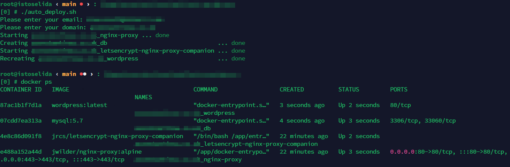
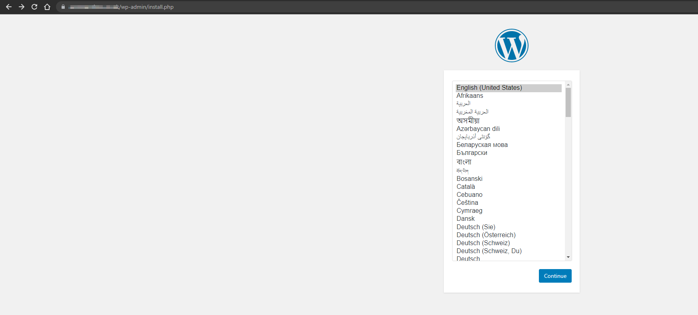

# Dockerized WordPress Deployment Script
This repository contains a bash script that automates the deployment of a Wordpress website using Docker. The script creates a setup with an Nginx proxy, Let's Encrypt for SSL, and a MySQL database. The services are defined in a docker-compose.yml file, which the script dynamically generates based on the user's inputs.

## Prerequisites
- Docker: This script requires Docker to run the services. You can install Docker with `sudo apt install docker.io`
- Docker-Compose: Docker-Compose is used to manage the Docker services.

The script checks for the presence of Docker and Docker-compose before starting the setup.

## Usage

```bash
sudo ./auto_deploy.sh
```



## Installation success




## Security Notice

You should replace "secure_password" in the script with a complex password.
